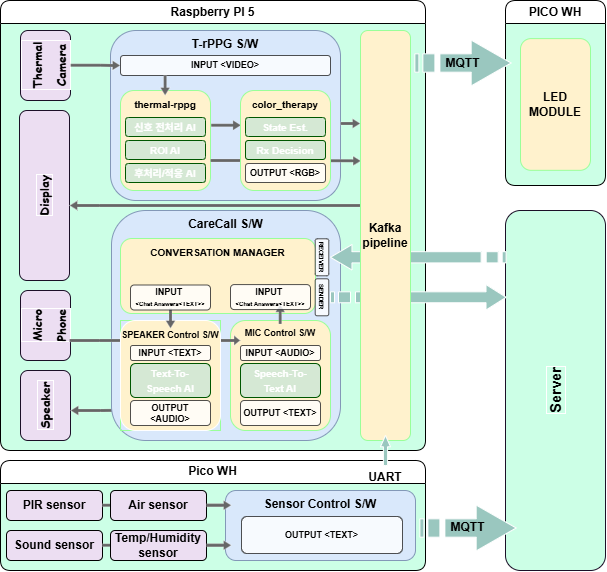
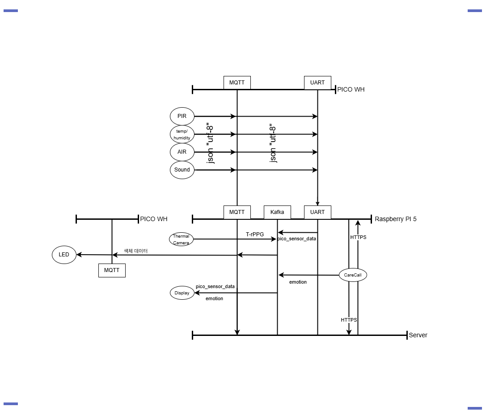

# DeepTree Hardware Overview

DeepTree는 Raspberry Pi 기반 엣지 디바이스에서 센서 데이터, 음성 대화, 생체신호 측정, 감정 기반 디스플레이 제어를 통합한 IoT 케어 시스템입니다.

이 문서는 기업 이력서나 포트폴리오에서 프로젝트 구조를 빠르게 설명하기 위한 하드웨어/데이터 흐름 개요입니다.

## Project Summary

- **프로젝트 목적**: 고령자 또는 돌봄 대상자의 환경 정보와 사용자 상태를 수집하고, 음성 기반 CareCall 및 시각 피드백을 제공하는 엣지 케어 시스템 구현
- **핵심 기능**: 센서 데이터 수집, Thermal rPPG 생체신호 측정, CareCall 음성 인터랙션, 감정 기반 LED/Display 제어
- **주요 통신 방식**: MQTT, Kafka, UART
- **주요 하드웨어**: Raspberry Pi 5, Raspberry Pi Pico WH, Thermal Camera, PIR Sensor, Air Sensor, Temperature/Humidity Sensor, Sound Sensor, Display, LED Module

## My Contribution

- Raspberry Pi와 Pico WH를 중심으로 한 전체 하드웨어 아키텍처 설계
- 센서 데이터가 UART, MQTT, Kafka를 통해 이동하는 데이터 흐름 정리
- Thermal rPPG, CareCall, Display, LED 모듈 간 연동 구조 설계
- 프로젝트 설명을 위한 시스템 아키텍처 및 데이터 플로우 다이어그램 작성

## Hardware Architecture

아래 다이어그램은 Raspberry Pi 5, Pico WH, 서버, 센서, CareCall, Thermal rPPG, Kafka pipeline, MQTT 연결 구조를 보여줍니다.

### Architecture Points

- Raspberry Pi 5가 주요 애플리케이션 실행 환경으로 동작합니다.
- Thermal Camera는 Thermal rPPG 모듈에 입력되어 비접촉 생체신호 측정에 사용됩니다.
- CareCall 모듈은 마이크 입력, STT/TTS, 대화 관리, 서버 연동을 담당합니다.
- Kafka pipeline은 내부 모듈 간 센서 및 상태 이벤트 전달에 사용됩니다.
- Pico WH는 센서 입력과 LED 모듈 제어를 담당하며 MQTT/UART로 Raspberry Pi 및 서버와 연결됩니다.

## Hardware Data Flow

아래 다이어그램은 센서 입력부터 MQTT, Kafka, UART, CareCall, Display, LED 모듈까지 이어지는 데이터 흐름을 보여줍니다.

### Data Flow Points

- PIR, 온습도, 공기질, 소리 센서 데이터는 Pico WH에서 수집됩니다.
- Pico WH는 센서 데이터를 UART 또는 MQTT를 통해 Raspberry Pi와 서버로 전달합니다.
- Raspberry Pi 내부에서는 Kafka 기반 파이프라인을 통해 센서 이벤트를 처리합니다.
- Thermal Camera 데이터는 rPPG 분석에 사용되고, 분석 결과는 Display 및 색채 치료 로직과 연동됩니다.
- CareCall 결과와 감정 상태는 Display 및 LED 피드백으로 연결됩니다.

## Tech Stack

- **Language**: Python
- **Edge Device**: Raspberry Pi 5, Raspberry Pi Pico WH
- **Messaging**: MQTT, Kafka, UART
- **AI/Signal Processing**: STT/TTS, Thermal rPPG, emotion/state decision logic
- **Display/Feedback**: Sensor dashboard, emotion video display, LED module

## Repository Guide

- `src/modules/carecall/`: CareCall 음성 인터랙션 모듈
- `src/modules/rppg/`: Thermal rPPG 및 색채 치료 연동 모듈
- `src/modules/display/`: 센서/감정 상태 표시 모듈
- `src/networks/`: Kafka, MQTT, UART 통신 모듈
- `src/test/`: 센서, 커넥터, Kafka 파이프라인 테스트 코드
- `docs/`: 시스템 구성, 문제 해결, 최적화 문서

## Notes for Reviewers

이 프로젝트는 단일 기능 구현보다 여러 하드웨어와 소프트웨어 모듈을 하나의 엣지 케어 시스템으로 통합하는 데 초점을 둔 프로젝트입니다. 특히 센서 입력, 생체신호 분석, 음성 대화, 디스플레이/LED 피드백이 실시간 데이터 흐름 안에서 연결되도록 설계했습니다.
